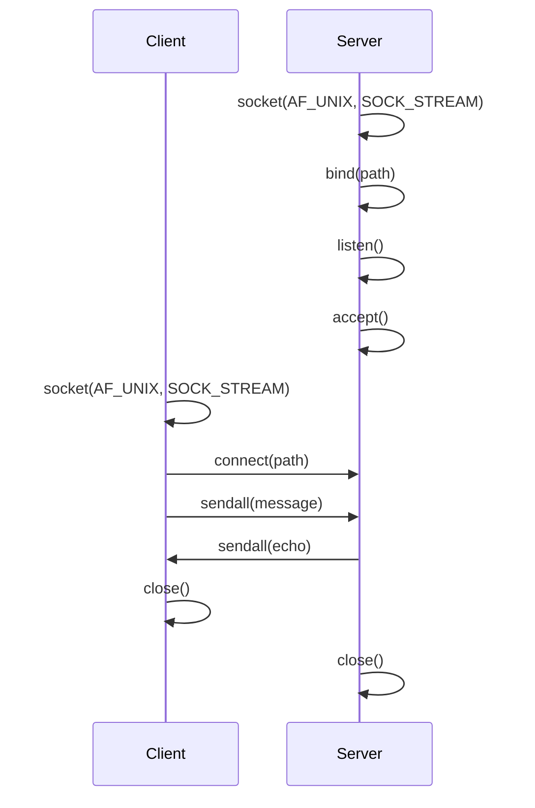

# UNIX Sockets

## Introduction
Applications require a way to communicate with eachother: for example, a web app needs to get a list of users from a database, or a messaging app needs to send a message to a friend. This process is known as "Inter-Process Communication" (IPC), and this can be achieved in many ways.

One could implement IPC by saving a message to a file, and having another file/user read from it. This would be slow, insecure, and have issues when more than one person tries to write to the file at the same time.

Another way would be to use [pipes](https://man7.org/linux/man-pages/man2/pipe.2.html) or [named pipes/FIFOs](https://man7.org/linux/man-pages/man7/fifo.7.html) to communicate between processes. These are obviously faster, but are also unidirectional and the input/output can only be consumed by one process at a time.

[Shared Memory (SHM)](https://man7.org/linux/man-pages/man7/shm_overview.7.html) offers another way to communicate between processes, but it is more complex to implement and manage - and can add security risks.

[UNIX Sockets](https://man7.org/linux/man-pages/man7/unix.7.html) offer a convenient way to communicate _bidirectionally_ between processes, and can be setup with added security features - and are the UNIX standard for IPC.


## Types of UNIX Sockets

Unix sockets (known by the Address Family `AF_UNIX` or `AF_LOCAL`) are identified by a file path. As a Unix convention, most sockets are created in the `/var/run` directory, but can live anywhere on the filesystem.

There are two types of Unix sockets: `stream` and `datagram` - these streams are not exclusive to Unix sockets, and you will find them not just with Unix sockets, but also with the standard IP addresses (part of the family `AF_INET` - i.e. IPv4 addresses); you might already know the implementation of Transmission Control Protocol (TCP) for streams, and User Datagram Protocol (UDP) for datagrams - but this chapter is focused on Unix sockets only.

All the transfer of data occurrs within the kernel - no data reaches the network stack.

### Streams

Steams are also known as **connection based** sockets: this means that each peer in a connection (i.e. a server or client) is aware that a connection has been made, and that message has been received by the other party. With this one can send a continue _stream_ (of an arbritary length) of bytes. This is very useful where a guarantee that a message has been successfully sent: like an email for example.

### Datagrams

Datagrams are also known as **connection-less** sockets: i.e. the other party never knows if the other has left. A datagram is a discrete message with boundaries - there is a beginning, body, and end to each one.

A nice analogy I have stolen from [this Stackoverflow response](https://stackoverflow.com/a/4688899) makes it a lot easier to visualise:

> A stream socket is like a phone call -- one side places the call, the other answers, you say hello to each other (SYN/ACK in TCP), and then you exchange information. Once you are done, you say goodbye (FIN/ACK in TCP). If one side doesn't hear a goodbye, they will usually call the other back since this is an unexpected event; usually the client will reconnect to the server. There is a guarantee that data will not arrive in a different order than you sent it, and there is a reasonable guarantee that data will not be damaged.

> A datagram socket is like passing a note in class. Consider the case where you are not directly next to the person you are passing the note to; the note will travel from person to person. It may not reach its destination, and it may be modified by the time it gets there. If you pass two notes to the same person, they may arrive in an order you didn't intend, since the route the notes take through the classroom may not be the same, one person might not pass a note as fast as another, etc.

> So you use a stream socket when having information in order and intact is important. File transfer protocols are a good example here. You don't want to download some file with its contents randomly shuffled around and damaged!

**Note well**: An important distinction to make with Unix datagram packets (compared to _network sockets_) is that the order of the packets are guaranteed, and the order will remain the same - but the analogy still holds!

## An example
We can create a quick example of how this works using python; although any language (including `ba/sh`) would be more than suffice here, although python has some advantages we can get into later (specifically - looking at contexts)!

```python
# server.py
import socket

with socket.socket(socket.AF_UNIX, socket.SOCK_STREAM) as sock:
    sock.bind("/tmp/docode.sock")
    sock.listen()
    print(f"Listening on {sock.getsockname()}")
    conn, address = sock.accept()
    with conn:
        while True:
            data = conn.recv(1024)
            print(f"Got connection with message: {data}")
            if not data:
                break
            conn.sendall(data)
```

If we run `python server.py` we can see the address we are listening on - but the program will appear to hang: it is awaiting a connection before proceeding!

We can prove the kernel is listenting on this socket by creating another terminal instance, and running

```sh
# the -l flag filters out those to ensure only sockets that are listenting are returned
# the -p flag shows the associated process
netstat -lp 
```

This will return _every socket_ that is listening for connections - we can filter out all of them to just see our process with:

```sh
netstat -lp | grep docode
```

In this same terminal we can run `python client.py` - check the output of each terminal!

```python
# client.py
import socket

with socket.socket(socket.AF_UNIX, socket.SOCK_STREAM) as sock:
    sock.connect("/tmp/docode.sock")
    sock.sendall(b"Hello, docode!")
    data = sock.recv(1024)

print(f"Received {data!r}")
```

Success! We should see that both the server and client process report the message!

### How did that work?

When calling 

```python
with socket.socket(socket.AF_UNIX, socket.SOCK_STREAM) as sock:
``` 

we are using a special python keywork `with` - this is known as a [context manager](https://docs.python.org/3/library/stdtypes.html#typecontextmanager) in python, which allows us to run code before we enter the `with` block (defined by a `__enter__` method), and run code afterwards (defined by a `__exit__` block). This is usually done to make sure we clean up code or states that are easy to forget to write! Often this is used in contexts when interfacing with files or networking where we want to close ports or release resources back to the operating system.

Looking at the source files we can see this is [exactly what is happening](https://github.com/python/cpython/blob/main/Lib/socket.py#L215-L242) with the socket class.

The setting `socket.AF_UNIX` denotes that we are using Unix address family, and the `socket.SOCK_STREAM` allows us to create the object in stream mode (rather than using a datagram).

Next we can instruct the kernel to bind the socket to a file with the settings we've defined with `bind`. Unlike other operating systems, a core philopsophy in Unix is that [everything is a file](https://en.wikipedia.org/wiki/Everything_is_a_file) - including sockets! The advantage of this is that the same tools we can use to handle "normal" files can be used to interface with other systems:

```python
sock.bind("/tmp/docode.sock")
sock.listen()
```

If we inspect the file generated after running the server file we can see it is a socket type (`file /tmp/docode.sock`).
Now our socket is setup and bound - our process needs to listen to the socket before anything happens. We're now listening to the socket created at `/tmp/docode.sock`.

We're now ready to `accept` connections from the operating system with `conn, address = sock.accept()`. Accept returns a tuple of a connection (a _new_ socket) and the address the sender we're receiving the message from exists at. This is a _synchronous_ or _blocking_ function - the rest of our program cannot run until we receive a message.

Finally, with our new `conn` object we can receive data and print it out to the user. This program echos the sent message back to the sender with `conn.sendall`. Once we have received all the available data and there is nothing left we can break out of the while loop, and our program then cleans up the connections (as we leave the with blocks).

```python
with conn:
    while True:
        data = conn.recv(1024)
        print(f"Got connection with message: {data}")
        if not data:
            break
        conn.sendall(data)
```

### The Client 

Our client script uses the same function calls, except connect instead of bind.

## Visualising what happened

State/process diagrams can make this easier to comprehend:

